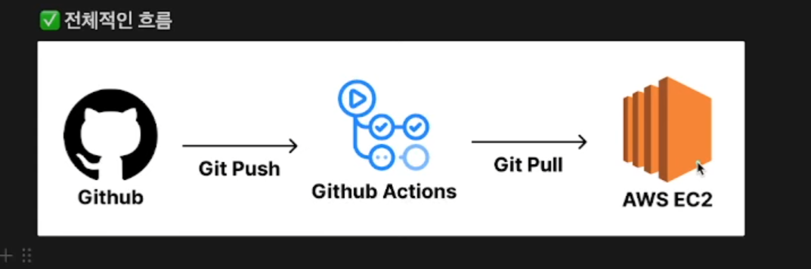

# 개인 프로젝트에서 많이 쓰는 CI/CD 구축 방법 (GitHub Actions)

## 🚀 장점

✅ **빠른 배포**
- `git pull`을 활용하여 변경된 부분만 업데이트하기 때문에 CI/CD 속도가 빠름
- 대부분의 CI/CD 방식은 전체 프로젝트를 다시 배포하지만, 이 방식은 차등 배포 가능

✅ **간단한 인프라 구조**
- GitHub Actions만 사용하므로 추가적인 CI/CD 툴이 필요 없음
- 별도의 CI/CD 서버를 운영할 필요 없이 간단한 구조 유지 가능

---

## ⚠️ 단점

❌ **EC2 서버의 성능 저하 가능성**
- 빌드 작업을 EC2에서 직접 수행하기 때문에 운영 중인 서버 성능에 영향을 미칠 수 있음

❌ **보안 취약점**
- GitHub 계정 정보가 EC2 서버에 저장되므로 보안 리스크 존재
- 개인 프로젝트 또는 신뢰할 수 있는 소규모 팀에서만 사용하는 것이 안전함

---

## 📌 언제 사용하면 좋은가?

- 개인 프로젝트에서 **심플하고 빠르게** CI/CD를 적용하고 싶을 때
- 복잡한 CI/CD 인프라를 구축하지 않고 간단한 배포 방식을 원할 때
- 작은 규모의 팀 프로젝트에서 운영 및 유지보수를 쉽게 하고 싶을 때

---

### ✨ 추가 참고

- GitHub Actions을 활용한 CI/CD 설정 예제는 [GitHub Actions 공식 문서](https://docs.github.com/en/actions)에서 확인할 수 있습니다.
- CI/CD 구축 시 `secrets.GITHUB_TOKEN`과 같은 보안 설정을 철저히 관리하세요.